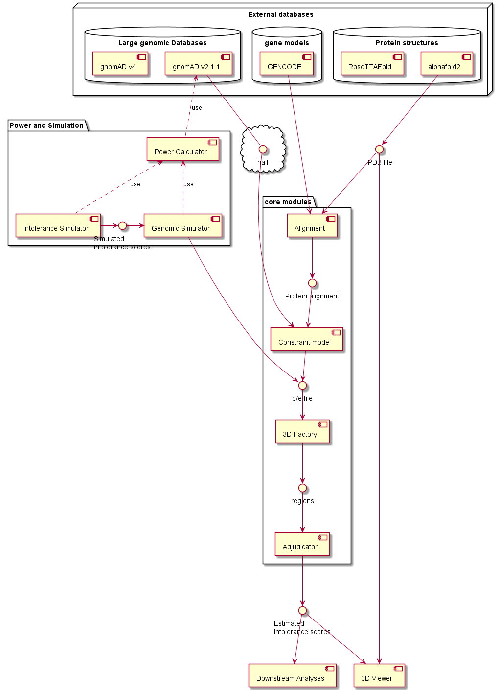

# Sofware architecture

## Overview

The structural-constraint project develops a new method for identifying compact 3D regions under missense constraint within protein tertiary structures.

The project is organised in independent components, interacting through defined interfaces.

## Components
### Alignment module
Provides the genomic coordinates of each nucleotide of each codon for the transect used by a given protein structure.

#### Interfaces
- input: A gene model, e.g. GTF file for a specific version of GENCODE

- input: 3D protein structure, e.g. PBR file from AlphaFold 2

- output: A protein alignment file (.tsv) with the following structure:

| Uniprot ID | HGNC gene | ENSG gene ID |  ENST transcript ID | residue index | Reference genome | genomic position | REF |
| --- | --- | --- | --- | --- | --- | --- | ---|
|P68133	|ACTA1|	ENSG00000143632	|ENST00000366684|	377|	GRCh37	|1:229567249G|	G|
|P68133	|ACTA1	|ENSG00000143632	|ENST00000366684	|377	|GRCh37	|1:229567250A	|A
|P68133	|ACTA1	|ENSG00000143632	|ENST00000366684	|377	|GRCh37	|1:229567251A	|A

### Constraint model module
For each codon: 

- calculate the number of expected missense mutations using a constraint model (e.g. gnomAD v2 constraint model)

- extract the number of observed missense mutations from a large genomic database (e.g. gnomAD v2.2.1)

#### Interfaces
- input: a protein alignment file

- input: access to a large genomic database (e.g. gnomAD v2 through hail)

- output: An o/e file (.tsv) with the following structure:

| residue index | obs | exp | exp_factor | exp_sigma |
| --- | --- |---|---|---|

### 3D Factory module
Creates candidate 3D regions and calculates their intolerance score (o/e) using specific criteria. 

### Adjudicator module
Assigns an intolerance score to each residue depending on the scores of the 3D regions it belongs to.

